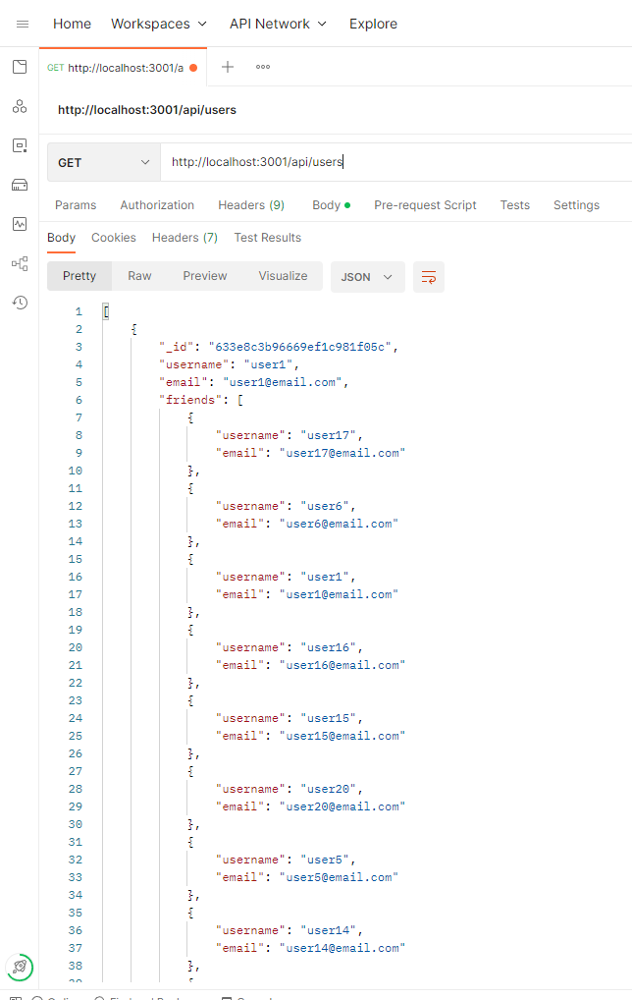

# social-network-api
## Installation
After downloading code, the necessary dependencies must be installed. This can be done by running the "npm i" command.

## Usage
Before running, the user can choose to start fresh with their own data, or run the seeded data to start with the sample data included in the code. The command "npm run seed" can be used to run the seed. The app can be run using the command "nodemon index.js". This app includes backend only. The functionality of the various routes can be viewed in Postman, Insomnia, or any other API platform. Using the API platform, requests can be sent to perform CRUD operations on the users and thoughts included in the database. Using post and delete requests, reactions can also be added to thoughts. 

[Github Repository](https://github.com/oguerra9/social-network-api)

[Video Walkthrough](https://drive.google.com/file/d/1HxvTTaXAqvicJRfENJpYWAaBad0w2T4p/view)
